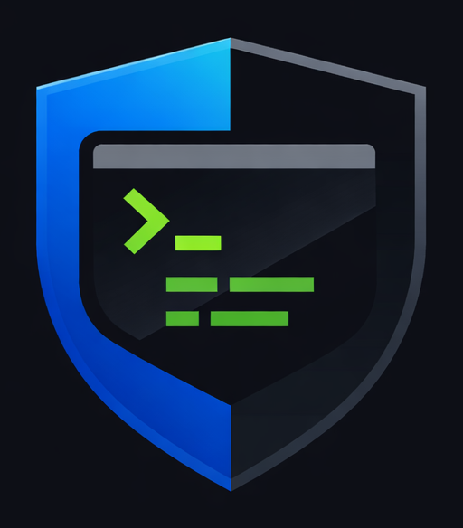

<p align="center">
  
</p>

<h1 align="center">MiniQuantDesk</h1>

<p align="center">
  Safety-first quantitative trading runtime
</p>


**MiniQuantDesk** is a safety-first, modular quantitative trading runtime designed to validate execution correctness, risk controls, and system integrity before scaling to live capital.

This project prioritizes **determinism, explicit refusal modes, and operational confidence** over alpha-chasing.

---

## Core Principles

- **Safety over strategy**
- **Explicit over implicit behavior**
- **Fail-fast in live mode**
- **Paper-first validation**
- **No hidden side effects**

MiniQuantDesk is built to make it *very hard* to accidentally trade when you didn’t mean to.

---

## What This Is (and Is Not)

### ✅ This *is*
- A production-grade **trading runtime**
- A **paper trading validation system**
- A framework for enforcing **risk, reconciliation, and execution invariants**
- A foundation for future AI/ML signal modules

### ❌ This is *not*
- A “plug-and-play money printer”
- A strategy marketplace
- A backtest-only toy
- A black-box trading bot

---

## Key Features

### 🧪 Smoke-Test Hardened
Explicitly designed to be safe to run on **any machine, any time**.

- `--once` mode always executes a single cycle
- Paper mode **never places live orders**
- Live mode **refuses to run with paper keys**
- Ctrl-C always exits cleanly (no hanging loops)

---

### 🧯 Live Safety Guards
- Live trading requires **explicit acknowledgement**
- PAPER keys are automatically rejected in LIVE mode
- Smoke mode disables order placement at the broker layer

---

### 📦 Deterministic Environment Loading
- Explicit `.env.local` loading
- Clear environment variable aliasing
- `--env-check` verifies readiness without trading

---

### 🧠 Modular Architecture
- Strategy registry
- Risk manager
- Execution engine
- Broker connectors
- Journaling and reconciliation

Each component can be validated independently.

---

## Quick Start

### 1️⃣ Install dependencies
```bash
python -m venv venv
source venv/bin/activate  # Windows: venv\Scripts\activate
pip install -r requirements.txt
2️⃣ Paper smoke test (safe)
python entry_paper.py --once
Expected behavior:

One cycle

Heartbeat printed

Market-closed is acceptable

Exit code 0

3️⃣ Live smoke test (safe refusal)
python entry_live.py --once --i-know-what-im-doing
Expected behavior:

PAPER keys → refusal

Clear error message

Non-zero exit code

No orders placed

4️⃣ Environment check
python entry_paper.py --env-check
python entry_live.py --env-check
Project Status
✅ Smoke track complete

✅ Paper trading validated for correctness

🚧 Strategy validation ongoing

🚧 Live trading intentionally restricted

This repository is under active development. Stability and correctness take priority over new features.

Roadmap (High Level)
Phase 1: Runtime correctness & paper validation

Phase 2: Advanced risk controls & monitoring

Phase 3: Multi-account orchestration

Phase 4: AI/ML signal modules (optional, isolated)

No phase compromises the safety guarantees of earlier phases.

Disclaimer
This software is for research and educational purposes.
Trading financial instruments involves risk.
You are responsible for understanding and complying with all applicable laws and broker terms.
